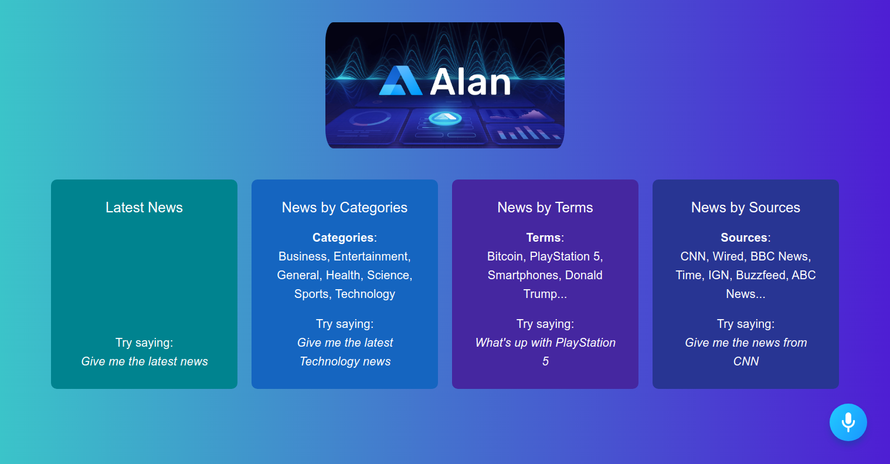

# Voice Controlled React AI-News Application - Alan AI Voice Assistant

## Introduction

In this project, I have built and deployed Conversational Voice Controlled React News Application using Alan AI. Alan AI is a speech recognition software that allows you to add voice capabilities to web applications. It allows user to control everything in the app using voice. I made this application by following this [tutorial](https://www.youtube.com/watch?v=rqw3OftE5sA)

### Get Latest News

### Get News by Source

### Get News by Term

### Get News by Category

Setup:

- run `npm i && npm start` to start development server
